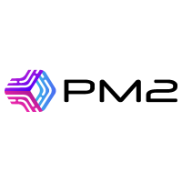
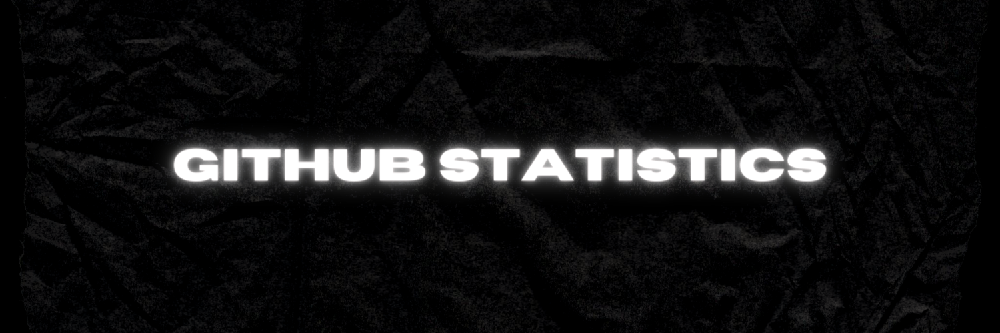
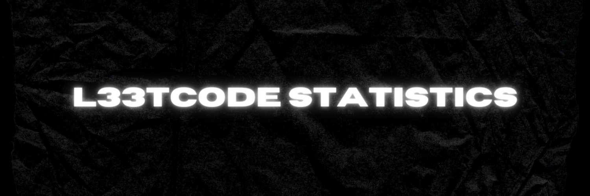

 

**Bringing a background in business administration and software engineering, I bridge the gap between strategy and tech through hands‑on engineering that drives impact.**

From prototype to production, I take full **end-to-end ownership**—architecture, code quality, deployment, monitoring, and real‑time support.

I design, ship, and maintain core systems with high availability, robust security, and cost efficiency in mind—solving real‑world problems on budget, on time, and with minimal downtime so your team can move fast with confidence.

Let’s build something that **works**—and keeps **working**.

 

**About Me**

-   💼 **Full‑Stack Engineer**—delivering web solutions that balance performance, reliability, and cost efficiency

-   🚀 **Passionate about crafting user‑centric applications** that solve real‑world challenges and drive measurable business impact

-   🤝 For inquiries or collaboration:  

 

    <a href="https://git-scm.com/" target="_blank" rel="noopener noreferrer"><code style="display: inline-flex; align-items: center; padding: 4px; border-radius: 6px; background-color: #333333;"></code></a>
    <a href="https://code.visualstudio.com/" target="_blank" rel="noopener noreferrer"><code style="display: inline-flex; align-items: center; padding: 4px; border-radius: 6px; background-color: #333333;"></code></a>
    <a href="https://www.postgresql.org/" target="_blank" rel="noopener noreferrer"><code style="display: inline-flex; align-items: center; padding: 4px; border-radius: 6px; background-color: #333333;"></code></a>
    <a href="https://www.gnu.org/software/bash/" target="_blank" rel="noopener noreferrer"><code style="display: inline-flex; align-items: center; padding: 4px; border-radius: 6px; background-color: #333333;"></code></a>
    <a href="https://developer.mozilla.org/en-US/docs/Web/JavaScript" target="_blank" rel="noopener noreferrer"><code style="display: inline-flex; align-items: center; padding: 4px; border-radius: 6px; background-color: #333333;"></code></a>
    <a href="https://www.typescriptlang.org/" target="_blank" rel="noopener noreferrer"><code style="display: inline-flex; align-items: center; padding: 4px; border-radius: 6px; background-color: #333333;"></code></a>
    <a href="https://go.dev/" target="_blank" rel="noopener noreferrer"><code style="display: inline-flex; align-items: center; padding: 4px; border-radius: 6px; background-color: #333333;"></code></a>
    <a href="https://www.nginx.com/" target="_blank" rel="noopener noreferrer"><code style="display: inline-flex; align-items: center; padding: 4px; border-radius: 6px; background-color: #333333;"></code></a>
    <a href="https://nodejs.org/" target="_blank" rel="noopener noreferrer"><code style="display: inline-flex; align-items: center; padding: 4px; border-radius: 6px; background-color: #333333;"></code></a>
    <a href="https://expressjs.com/" target="_blank" rel="noopener noreferrer"><code style="display: inline-flex; align-items: center; padding: 4px; border-radius: 6px; background-color: #333333;"></code></a>
    <a href="https://developer.mozilla.org/en-US/docs/Web/HTML" target="_blank" rel="noopener noreferrer"><code style="display: inline-flex; align-items: center; padding: 4px; border-radius: 6px; background-color: #333333;"></code></a>
    <a href="https://developer.mozilla.org/en-US/docs/Web/CSS" target="_blank" rel="noopener noreferrer"><code style="display: inline-flex; align-items: center; padding: 4px; border-radius: 6px; background-color: #333333;"></code></a>
    <a href="https://reactjs.org/" target="_blank" rel="noopener noreferrer"><code style="display: inline-flex; align-items: center; padding: 4px; border-radius: 6px; background-color: #333333;"></code></a>
    <a href="https://nextjs.org/" target="_blank" rel="noopener noreferrer"><code style="display: inline-flex; align-items: center; padding: 4px; border-radius: 6px; background-color: #333333;"></code></a>
    <a href="https://styled-components.com/" target="_blank" rel="noopener noreferrer"><code style="display: inline-flex; align-items: center; padding: 4px; border-radius: 6px; background-color: #333333;"></code></a>
    <a href="https://redux.js.org/" target="_blank" rel="noopener noreferrer"><code style="display: inline-flex; align-items: center; padding: 4px; border-radius: 6px; background-color: #333333;"></code></a>
    <a href="https://babeljs.io/" target="_blank" rel="noopener noreferrer"><code style="display: inline-flex; align-items: center; padding: 4px; border-radius: 6px; background-color: #333333;"></code></a>
    <a href="https://axios-http.com/" target="_blank" rel="noopener noreferrer"><code style="display: inline-flex; align-items: center; padding: 4px; border-radius: 6px; background-color: #333333;"></code></a>
    <a href="https://www.chartjs.org/" target="_blank" rel="noopener noreferrer"><code style="display: inline-flex; align-items: center; padding: 4px; border-radius: 6px; background-color: #333333;"></code></a>
    <a href="https://jwt.io/" target="_blank" rel="noopener noreferrer"><code style="display: inline-flex; align-items: center; padding: 4px; border-radius: 6px; background-color: #333333;"></code></a>
    <a href="https://cloudinary.com/" target="_blank" rel="noopener noreferrer"><code style="display: inline-flex; align-items: center; padding: 4px; border-radius: 6px; background-color: #333333;"></code></a>
    <a href="https://pm2.keymetrics.io/" target="_blank" rel="noopener noreferrer"><code style="display: inline-flex; align-items: center; padding: 4px; border-radius: 6px; background-color: #333333;"></code></a>
    <a href="https://www.brevo.com/" target="_blank" rel="noopener noreferrer"><code style="display: inline-flex; align-items: center; padding: 4px; border-radius: 6px; background-color: #333333;"></code></a>
    <a href="https://developer.mozilla.org/en-US/docs/Web/API/Notifications_API" target="_blank" rel="noopener noreferrer"><code style="display: inline-flex; align-items: center; padding: 4px; border-radius: 6px; background-color: #333333;"></code></a>

 

| </a> | </a> |
| ------------------------------------------------------------------------------------------------------------------------------------------------------------------------------------------------------------------------------------------------------------------------------------------------------------------------------------------------------- | ------------------------------------------------------------------------------------------------------------------------------------------------------------------------------------------------ |

    

